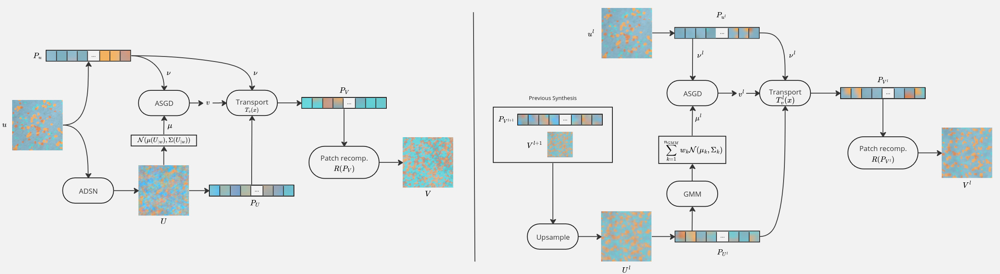

# Paper study : A Texture Synthesis Model Based on Semi-Discrete Optimal Transport in Patch Space

    

### Project for the course [Introduction to numerical imaging](https://perso.telecom-paristech.fr/gousseau/MVA/) at Master MVA

This project provides an in-depth analysis and extensions of the following paper
> Bruno Galerne, Arthur Leclaire, Julien Rabin. A Texture Synthesis Model Based on Semi-discrete Optimal Transport in Patch Space. SIAM Journal on Imaging Sciences, 2018, ⟨10.1137/18M1175781⟩. ⟨hal-01726443v2⟩

Most of the code included in this repostory comes from the official codebase of the paper (https://plmlab.math.cnrs.fr/aleclaire/texto/-/tree/master). 

In this paper review, we study the method presented in the paper which uses a patched-based method. The approach relies on the use of semi-discrete
optimal transport - ie between a continuous and a discrete distribution- to reimpose the patch distribution of the exemplar texture across multiple scales. The goal of this project is to provide quantitative measures of the statistical properties of patches from the synthesis, and understand the method's strengths and weaknesses with qualitative evaluation. We also propose extensions of the method and critically discuss their effectiveness and results compared to the original baseline. Our experiments show that modelling the source distribution with a Gaussian Mixture Model can be simplified by a random sampling of patches in the current synthesis, which reduces the Wasserstein distance between the transported patches and the target distribution. We also propose an alternative method that replaces the semi-discrete optimal transport with affine transport, which greatly simplifies the model and provides equivalent results. [Our report](IIN_report.pdf) contains the paper analysis, our results and critical perspectives.
